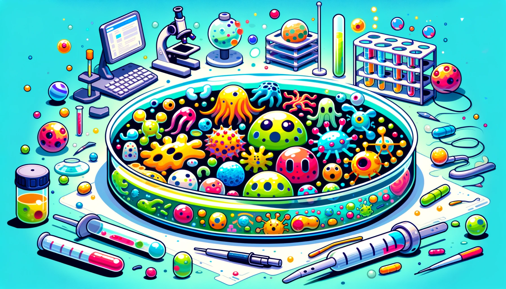

# microbiome🦠



This repository implements an Agar.io-like game that takes place in a petri dish. Players control several microbes that can eat food, attack other microbes, and reproduce! The game is written in Rust using `ggez` for graphics!

## How to Play

### Controls

Red particles are food, and other colors represent microbes. The player controls their microbes (which are centered on the screen) by moving the mouse. The microbes will follow the mouse cursor. The player can press the space bar to perform mitosis, creating new microbes. Smaller microbes travel faster and are more agile, but larger microbes can eat smaller ones. The player's microbes can also merge together by colliding with each other.


### The AI

Each color of microbe is controlled by a separate AI instance. This AI looks at the surrounding microbes and food particles to determine the best course of action. It performs a weighted sum of the vectors pointing to each nearby microbe and food particle to determine the direction to move, using positive weights for food and smaller microbes, and negative weights for larger microbes. The AI also has a chance to perform mitosis or to merge its microbes. The AI is surprisingly effective at picking off smaller microbes and avoiding larger ones! Watch out!

### Winning the Game

To win the game, the player must eat all microbes in the petri dish not controlled by the player. The player loses if all of their microbes are eaten by other microbes! Once the game finishes, you can press the space bar to restart the game.

## How to Run

To run the game, you must have Rust installed on your machine. You can install Rust by following the instructions [here](https://www.rust-lang.org/tools/install). Once you have Rust installed, you can run the game by executing the following command:

```bash
$ cargo run --release
```

This command will compile the game and run it. You can exit the game by pressing the `Esc` key.

## License

This project is licensed under the MIT License. You can view the license [here](LICENSE).
